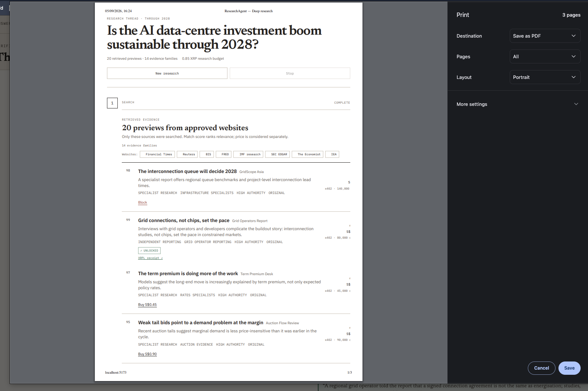
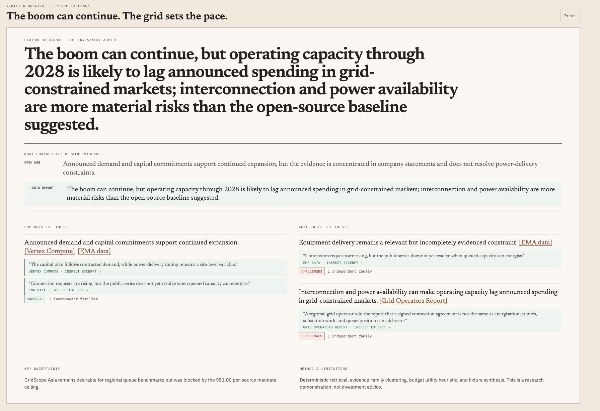

# ResearchAgent

ResearchAgent is a SingHacks 2026 Ripple/XRPL-track prototype for budget-aware
research. Give it a question, a list of approved websites, and a research
budget. It retrieves evidence, identifies what is missing, decides which
premium source is worth buying, and produces a cited dossier.

The product is designed around a simple rule: an agent should spend money only
when the next piece of evidence can materially change or strengthen the answer.

> This is a hackathon prototype, not investment advice. The included article
> corpus is synthetic. Fixture settlement models the payment boundary and does
> not pay a real publisher.

## What ResearchAgent demonstrates

- React/Vite research desk with an Express API.
- Editable research question, decision context, horizon, website allowlist,
  and XRP budget.
- Deterministic retrieval and ranking across 20 synthetic source records.
- Evidence-family clustering so duplicate reporting is not counted as
  independent corroboration.
- Server-side budget enforcement, purchase eligibility, and premium access
  control.
- Groq-powered purchase planning and cited dossier synthesis.
- x402-style quotes with XRP drop amounts.
- Optional validated XRPL Testnet settlement.
- Server-Sent Events for research progress and streamed dossier tokens.
- Claim-level citations checked against exact source and evidence-span IDs.

## Screenshots

### Architecture


### Evidence and dossier

<p>
  
  
</p>

## Prerequisites

- Node.js 20.19+ or 22.12+.
- npm.
- A Groq API key. The intended hackathon demo is configured with live Groq
  planning and synthesis; set up the key before starting the app.
- XRPL Testnet credentials only if you want to submit a real Testnet payment;
  fixture settlement is used while the payment adapter is not explicitly
  enabled.

## Setup

From the repository root:

```bash
cd tftf/prototypes/ResearchAgent
npm install
cp .env.example .env
```

Edit `.env` and add the required Groq configuration:

```dotenv
APP_MODE=fixture
PORT=8788
PUBLIC_APP_URL=http://localhost:5173

LLM_PROVIDER=groq
GROQ_API_KEY=gsk_your_groq_key_here
LLM_MODEL=llama-3.3-70b-versatile
LLM_BASE_URL=https://api.groq.com/openai/v1/chat/completions
LLM_TIMEOUT_MS=30000
LLM_SYNTHESIS_TEMPERATURE=0.85

# Keep fixture settlement unless XRPL Testnet payment is explicitly enabled.
XRPL_MODE=fixture
XRPL_NETWORK=testnet
XRPL_RPC_URL=wss://s.altnet.rippletest.net:51233
XRPL_EXPLORER_URL=https://testnet.xrpl.org/transactions
```

Start the client and API together:

```bash
npm run dev
```

Open [http://localhost:5173](http://localhost:5173). The Vite client proxies
`/api` requests to the Express API on port `8788`.

## Groq setup

1. Create a Groq API key in the Groq console.
2. Put the key in `prototypes/ResearchAgent/.env` as `GROQ_API_KEY`.
3. Set `LLM_PROVIDER=groq`.
4. Set `LLM_MODEL` to a model available to your Groq account.
5. Restart `npm run dev` after changing `.env`.

Groq is used in two bounded places:

1. **Purchase planning** — after the deterministic server retrieves and ranks
   source previews, Groq selects one eligible premium source and explains the
   evidence gap it would address.
2. **Dossier synthesis** — after open evidence and purchased excerpts are
   available, Groq streams a concise dossier. The server validates every claim
   against the source IDs and accessible evidence-span IDs before display.

Groq does not search the web in this build and cannot override the website
allowlist, research budget, per-source ceiling, payment checks, or access
grant. If the live Groq request fails, the server records the fallback state;
for the intended judging flow, verify that the key is valid and that
`LLM_PROVIDER=groq` is shown in the status bar.

### Groq environment variables

| Variable | Required | Purpose |
| --- | --- | --- |
| `LLM_PROVIDER` | Yes | Set to `groq` to enable the live provider |
| `GROQ_API_KEY` | Yes | Server-only Groq credential |
| `LLM_MODEL` | Yes | Groq model used for planning and synthesis |
| `LLM_BASE_URL` | No | OpenAI-compatible chat-completions endpoint |
| `LLM_TIMEOUT_MS` | No | Purchase-planning request timeout |
| `LLM_SYNTHESIS_TEMPERATURE` | No | Dossier prose temperature from `0` to `2` |

Never put `GROQ_API_KEY` in React code, browser storage, a `VITE_` variable,
the client bundle, `.env.example`, a commit, or a screenshot. `.env` is
ignored by Git and must remain local.

## Optional XRPL Testnet payment

Use this only when you have an explicitly authorized, funded Testnet wallet.
Never use a mainnet seed with this prototype.

Add the following to the local `.env`:

```dotenv
XRPL_MODE=live
XRPL_NETWORK=testnet
XRPL_RPC_URL=wss://s.altnet.rippletest.net:51233
XRPL_PAYER_SEED=s_your_testnet_seed
XRPL_PAYER_ADDRESS=rYourPayerAddress
XRPL_RECEIVER_ADDRESS=rYourReceiverAddress
XRPL_EXPLORER_URL=https://testnet.xrpl.org/transactions
```

`XRPL_PAYER_SEED` and `XRPL_PAYER_ADDRESS` identify the paying Testnet wallet;
`XRPL_RECEIVER_ADDRESS` is the destination account. The receiver does not
need to provide a secret. The server checks that the submitted transaction is
validated, returns `tesSUCCESS`, uses the configured payer and receiver, and
delivers the exact quoted amount before unlocking the resource.

The seed is server-only. Do not commit it, send it to the browser, include it
in logs, or store it in persisted run data. Mainnet settlement is deliberately
not supported.

## Run the demo

1. Enter a research question, or use the data-centre-through-2028 example.
2. Select the website profiles the agent may use.
3. Set the XRP research budget. The UI displays the fixture conversion of
   `1 XRP ≈ S$10.00`.
4. Start research and follow the phases: plan, discover, rank, read open
   evidence, find gaps, and allocate budget.
5. Inspect the source previews. Premium article bodies remain protected until
   the matching purchase decision is recorded.
6. Let the agent buy useful evidence, skip a duplicate, or block a source
   above the mandate ceiling.
7. Select **Synthesize dossier** to stream the Groq answer.
8. Open citations to inspect the exact evidence spans. Use **Print** in the
   dossier view to save a browser-generated PDF.

The canonical story uses a S$2.00 total budget and a S$1.00 per-source ceiling:

```text
S$2.00 mandate
  → buy Northstar Wire for S$0.20
  → skip the redundant Circuit Note
  → buy the Grid Operators Report for S$0.80
  → block GridScope Asia at S$1.40
  → synthesize a more cautious, source-linked conclusion
```

## Commands

Run these from `tftf/prototypes/ResearchAgent`:

```bash
npm run dev          # Vite client + Express API
npm run dev:client   # Vite client only
npm run dev:server   # Express API only
npm run typecheck    # TypeScript validation
npm test             # Unit tests
npm run build        # Production build
npm run verify       # Typecheck + tests + build
npm run seed         # Clear data/runs.json
npm run preview      # Preview the Vite production build
```

`npm run seed` clears the local persisted run history. It does not modify the
synthetic source corpus.

## API overview

The Express API is versioned under `/api/v1`:

- `GET /api/health` — health and active runtime mode.
- `GET /api/v1/config/public` — non-secret client configuration.
- `GET /api/v1/scenarios/data-centre-2028` — canonical brief and source list.
- `POST /api/v1/research-runs` — create a research run.
- `POST /api/v1/research-runs/:runId/step` — advance, pause, or resume.
- `POST /api/v1/research-runs/:runId/purchase-decisions` — run purchase
  planning.
- `POST /api/v1/research-runs/:runId/purchases` — buy, skip, or block a source.
- `GET /api/v1/research-runs/:runId/sources/:sourceId` — inspect source access.
- `POST /api/v1/research-runs/:runId/synthesize` — synthesize the dossier.
- `GET /api/v1/research-runs/:runId/dossier` — retrieve the validated dossier.
- `GET /api/v1/research-runs/:runId/receipt` — retrieve payment metadata.
- `GET /api/v1/research-runs/:runId/stream` — research and synthesis SSE.

## Architecture and trust boundaries

```text
Question + website allowlist
  → React research desk
  → Express API
  → fixture source registry + deterministic ranking
  → gap analysis + server-side budget guard
  → x402 quote
  → fixture settlement or validated XRPL Testnet payment
  → exact access grant
  → Groq cited dossier
```

The browser is a view and command surface. The server owns allowlist
filtering, ranking, budget arithmetic, purchase eligibility, persistence,
premium access, payment verification, and citation validation. Premium bodies
are stored server-side and are not returned before purchase.

Detailed implementation notes are in:

- [`ARCHITECTURE.md`](prototypes/ResearchAgent/ARCHITECTURE.md)
- [`SECURITY.md`](prototypes/ResearchAgent/SECURITY.md)
- [`VERIFICATION.md`](prototypes/ResearchAgent/VERIFICATION.md)
- [`PRODUCT.md`](prototypes/ResearchAgent/PRODUCT.md)

## Troubleshooting

### Groq appears as fixture or fallback

Check that `.env` contains `LLM_PROVIDER=groq`, that `GROQ_API_KEY` is present,
and that `LLM_MODEL` is available to the account. Restart the dev server after
editing `.env`.

### The page loads but API calls fail

Confirm that both the Vite client (`5173`) and Express API (`8788`) are
running. `npm run dev` starts both and stops stale ResearchAgent processes on
those ports.

### XRPL Testnet payment fails

Confirm `XRPL_MODE=live`, `XRPL_NETWORK=testnet`, a funded Testnet payer seed,
matching payer address, and a different receiver address. Keep fixture mode
enabled until the wallet and destination are ready.

### I need a clean run

Stop the dev server, run `npm run seed`, and start `npm run dev` again.

## Prototype status

ResearchAgent is prepared for local hackathon demonstration. Production use
would additionally require authentication, secret-management infrastructure,
rate limiting, transactional persistence, retention controls, real source
licensing, and a production payment/access provider.
