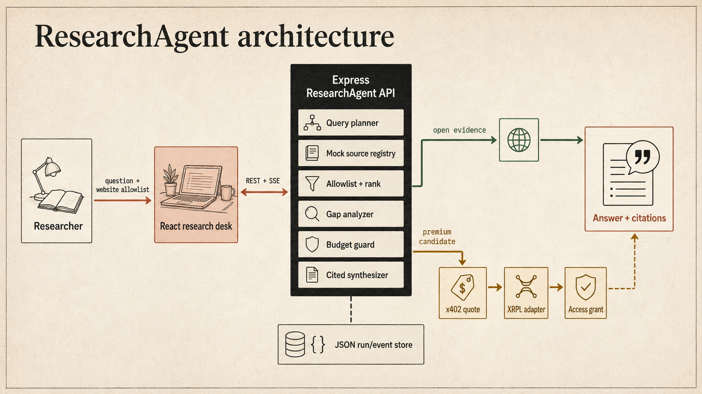
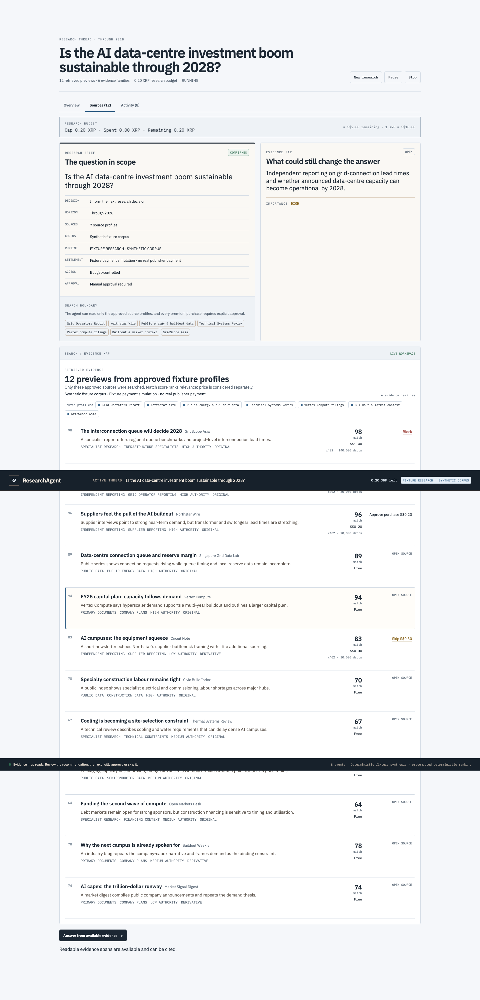
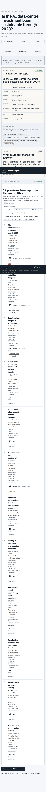

# ResearchAgent

ResearchAgent is a local prototype for budget-aware deep research. It turns a
supported question into an approved research plan, ranks synthetic evidence,
shows where the answer is weak, and lets a user decide whether a premium source
is worth buying under an explicit spending mandate.

The default experience is deterministic and credential-free. It uses a
synthetic data-centre research corpus, fixture LLM behavior, and simulated
settlement. Optional Groq synthesis and XRPL Testnet settlement are separate,
server-side modes; neither is required to run the canonical demonstration.

> ResearchAgent is a research prototype, not investment advice. Fixture
> sources are fictional, fixture payment does not pay a publisher, and Testnet
> assets have no monetary value.

## What the prototype proves

- A guided Question → Sources → Budget → Review flow before research starts.
- Truthful rejection of questions outside the supported fixture scenario.
- Deterministic retrieval and ranking across 12 synthetic source records.
- Evidence-family clustering so repeated reporting is not counted as
  independent corroboration.
- A cited open-evidence answer without requiring a purchase.
- Optional premium proposals with an exact, manual approval checkpoint.
- Server-owned budgets, per-source ceilings, quote binding, idempotency, and
  protected-content access.
- A visible distinction between plan approval, purchase approval, settlement,
  fulfilment, and citation validation.
- Claim-level citations bound to accessible source and evidence-span IDs.
- Local persistence, reset-safe historical receipts, pause/resume, and recovery
  from stale or unknown states.

## Product views



<p>
  
  
</p>

## Quick start

Prerequisites:

- Node.js 20.19+ or 22.12+.
- npm.

From the repository root:

```bash
npm install
cp .env.example .env
npm run dev
```

Open [http://localhost:5100](http://localhost:5100). The Vite client proxies
API requests to the Express service on port `8788`.

The checked-in environment example already selects the safe default:

```dotenv
APP_MODE=fixture
LLM_PROVIDER=fixture
XRPL_MODE=fixture
```

No provider key or wallet credential is needed for this mode.

## Canonical demonstration

Use the supplied question about whether announced AI data-centre buildout can
become operating capacity by 2028. The fixture classifier intentionally
rejects unrelated questions instead of returning polished but irrelevant
evidence.

Recommended five-to-seven-minute path:

1. Start with the canonical question and choose the approved source profiles.
2. Set the maximum research spend and review the generated plan. Emphasize that
   plan approval does not authorize a purchase.
3. Start research and inspect the 12 previews and their evidence families.
4. Generate a cited answer from accessible open evidence to prove that payment
   is optional.
5. Review the premium candidates: buy an affordable, useful source; skip a
   duplicate; and show a source blocked by the per-source ceiling.
6. Inspect the exact quote before confirming the fixture purchase.
7. Open a claim citation and its accessible evidence span, then show the cited
   dossier and receipt metadata.

The canonical S$2.00 fixture mandate demonstrates:

```text
buy Northstar Wire for S$0.20
  → skip Circuit Note as a duplicate
  → buy the Grid Operators Report for S$0.80
  → block GridScope Asia at S$1.40
  → synthesize a more cautious, source-linked conclusion
```

The S$ conversion is a fixture approximation for the scenario. It is not a
live exchange rate and is not used to value Testnet XRP.

## Runtime modes

| Concern | Default fixture | Optional live seam |
| --- | --- | --- |
| Evidence | 12 local synthetic records | Live source adapters are not implemented |
| Planning and synthesis | Deterministic fixture behavior | Groq, when explicitly configured |
| Payment | x402-style quote and simulated settlement | Validated XRPL Testnet payment |
| Storage | Local JSON run/event store | Production persistence is not implemented |
| Access | Exact synthetic spans after a recorded fixture decision | Real publisher fulfilment is not implemented |

### Optional Groq

Set `LLM_PROVIDER=groq`, `GROQ_API_KEY`, and an available `LLM_MODEL` in the
ignored local `.env`, then restart the server. Groq receives bounded source
previews and metadata for purchase planning and accessible evidence for dossier
synthesis. It cannot widen the source allowlist, bypass the budget, approve a
purchase, unlock protected text, or make an invalid citation final.

Never place a provider key in React code, browser storage, a `VITE_` variable,
screenshots, or committed files.

### Optional XRPL Testnet

Keep `XRPL_MODE=fixture` unless a funded Testnet run is explicitly intended.
For Testnet, configure `XRPL_MODE=live`, the Testnet RPC URL, payer address,
receiver address, and `XRPL_PAYER_SEED` in the ignored local `.env`.

The seed stays server-side. Never use a mainnet seed. The server must validate
the transaction result, payer, receiver, and exact quoted amount before access
is granted. A successful payment and successful content fulfilment remain
separate states.

## Architecture and trust boundary

```text
Question + approved source profiles + maximum spend
  → guided React workspace
  → Express API and persisted run
  → scope gate + plan approval
  → synthetic registry + deterministic ranking + family clustering
  → open-evidence answer and/or optional premium proposal
  → server budget guard + exact quote + manual approval
  → fixture settlement or validated XRPL Testnet payment
  → exact access grant
  → server-validated cited dossier
```

The browser presents state and sends intent. The server owns supported scope,
plan approval, source filtering, budget arithmetic, purchase eligibility,
quote binding, settlement verification, premium access, and citation validity.
Premium article bodies are server-side and are not returned before access is
granted.

## Commands

```bash
npm run dev          # client and API
npm run dev:stop     # stop known local development ports
npm run lint         # lint the codebase
npm run typecheck    # TypeScript validation
npm test             # unit and API tests
npm run test:e2e     # browser journeys
npm run test:a11y    # focused accessibility browser check
npm run build        # production build
npm run verify       # repository verification aggregate
npm run seed         # clear local persisted run history
npm run preview      # preview the production build
```

Browser tests use an isolated `.playwright/runs.json` store and do not mutate
the normal `data/runs.json` demo history.

## Documentation

Start with the [documentation index](docs/README.md):

- [Product roadmap](docs/PRODUCT-ROADMAP-2026.md)
- [October 1 presentation readiness plan](docs/PRESENTATION-READINESS.md)
- [Next-stage UX brief](docs/UX-NEXT-STAGE.md)
- [Company and protocol context](company-research-context.md)
- [Product, architecture, design, security, and UX contracts](docs/contracts/)
- [Standalone architecture diagrams](diagrams/README.md)
- [Editable UX wireframes](canvas/excalidraw/README.md)

## Current boundaries

ResearchAgent is a local single-user prototype. Production use would require
authentication, managed secrets, rate limits, transactional storage, retention
controls, licensed source integrations, robust reconciliation, and a real
publisher fulfilment contract. History/library navigation and live web search
should not be claimed until their product and persistence contracts exist.
