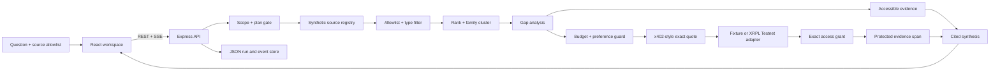

# Architecture contract

The browser is a view and command surface. The Express server owns supported
scope, retrieval, allowlist filtering, ranking, evidence-family lineage,
budget arithmetic, premium access, fixture x402 quotes, settlement validation,
and cited synthesis. The 12 synthetic data-centre records live in
`data/mock-articles.json`; public metadata is available before purchase, while
protected excerpts remain server-side until access is granted.

## Visual overview

## Trust boundaries

1. The run records the question, approved source profiles, maximum spend, and
   per-source ceiling before retrieval.
2. The fixture scope gate rejects unsupported questions rather than silently
   mapping them to unrelated evidence.
3. The source registry strips protected article bodies from public responses.
4. The server-owned budget guard can approve, block, skip, or defer a proposal;
   browser text and model output cannot bypass it.
5. Plan approval and exact purchase approval are separate mutations.
6. Fixture settlement is a simulation. Optional XRPL Testnet mode must validate
   payer, receiver, amount, finality, and quote binding before access.
7. Payment and fulfilment are separate states. Access grants unlock exactly one
   resource version after fulfilment succeeds.
8. Final synthesis may cite only accessible, server-validated evidence spans.
   Model reasoning is not a policy or audit artifact.

## Runtime modes

| Layer | Default | Optional seam |
| --- | --- | --- |
| Evidence | 12 local synthetic records | Authorized live adapters are future work |
| Planning and synthesis | Deterministic fixture behavior | Groq, explicitly configured server-side |
| Settlement | x402-style quote and fixture result | XRPL Testnet transaction validation |
| Persistence | Local JSON run/event store | Production storage is future work |
| Fulfilment | Synthetic exact access grant | Real publisher delivery is future work |

No browser bundle may contain provider credentials or wallet seeds. Fixture,
Testnet, and production claims must remain visibly distinct.
