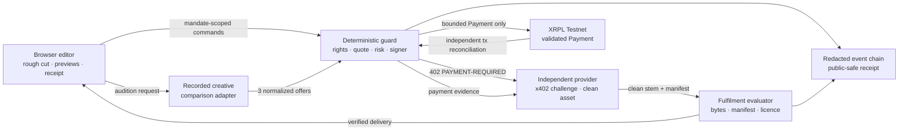

# FairCut architecture

## Trust zones

- **Browser:** renders the editor, watermarked previews, human-readable
  decisions, and receipt. It cannot submit arbitrary transaction JSON and never
  receives a seed or private key.
- **Agent adapter:** records creative timing/mood rationale and candidate
  ranking. It cannot approve rights, expand the mandate, or sign.
- **Deterministic guard:** owns the mandate, ODRL-shaped rights checks, payee
  binding, x402 quote comparison, risk-source label, replay boundary, and
  server-only signer boundary.
- **Provider adapter:** exposes a pinned x402 v2-style challenge and keeps the
  clean master outside the browser’s public bundle.
- **Ledger adapter:** accepts only the stored eligible intent, signs a bounded
  XRP `Payment` on XRPL Testnet, then queries the same hash independently.
- **Fulfilment evaluator:** hashes the returned bytes, checks the delivery
  manifest and ODRL digest, confirms MIME/timing/placement/attribution/order,
  and prevents clean-stem insertion on any mismatch.

`demo-local` uses the same state machine with a local fixture ledger and an
explicit `SIMULATION — NOT SETTLED` label. `testnet-live` uses the server-only
XRPL adapter. `recorded-testnet` displays an earlier independently validated
hash for stable rehearsal and is never presented as a fresh payment.
