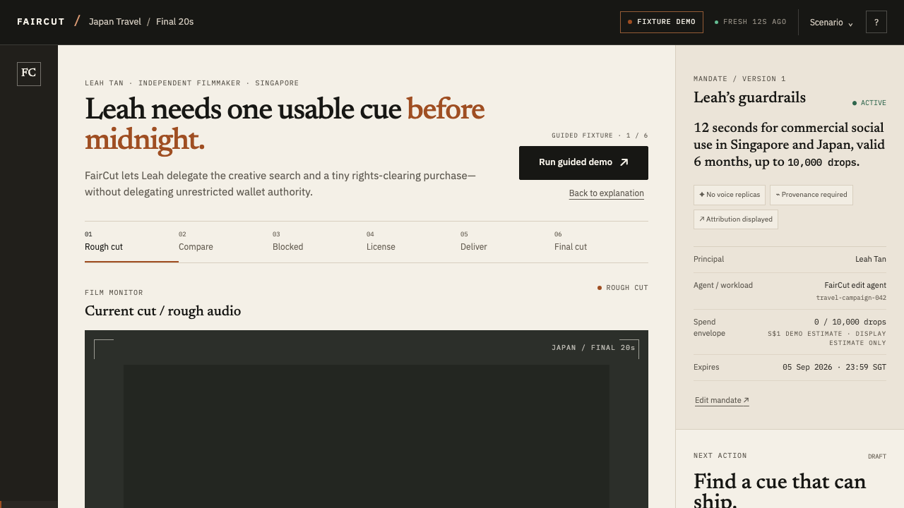

# FairCut

FairCut is an editor-shaped prototype for one narrow question: can Leah buy
exactly the 12 seconds she needs without giving an AI agent unrestricted wallet
authority?

The demo opens on the populated project at `http://localhost:5173/demo` (Vite
serves the SPA fallback; `/` is equivalent). The default `demo-local` mode is a
deterministic fixture rehearsal. It is intentionally labelled
`SIMULATION — NOT SETTLED` and cannot satisfy the live XRPL evidence requirement
by itself.

## Preview



The repository also includes responsive and failure-state captures under
[`verification/`](verification/).

## Run

```bash
npm install
npm run generate:media
npm run dev
```

Open `http://localhost:5173/demo`. To serve a production build:

```bash
npm run build
npm run serve
```

Modes are explicit through `.env`:

- `demo-local` (default): original fixture offers, local deterministic rights
  policy, fixture merchant, and no wallet/network requirement.
- `offline-rehearsal`: reserved for recorded simulation; never settlement.
- `recorded-testnet`: optional stable rehearsal label for a real hash supplied
  through `FAIRCUT_RECORDED_TX_HASH`; it is evidence from an earlier run, not a
  fresh payment.
- `testnet-live`: the server-only XRPL adapter can use `FAIRCUT_XRPL_SEED` and
  `FAIRCUT_XRPL_URL` to construct a bounded `Payment` against Testnet. It signs
  only the stored eligible intent, includes invoice MemoData and SourceTag, and
  independently queries `validated` + `tesSUCCESS` before a live claim.

The live adapter is intentionally not enabled by default. Fund a disposable
Testnet wallet with the official XRPL Testnet faucet, configure only the server
environment, and never put a seed in `VITE_*`, browser storage, logs, or source.
No Mainnet configuration is supported by this prototype.

## Architecture

```text
Browser editing desk
  ├─ rough cut, preview audio, waveform, mandate, receipt drawer
  └─ server commands (never arbitrary transaction JSON)
       ├─ Discovery + recorded creative assessment
       ├─ Deterministic ODRL-shaped rights evaluator + payee binding
       ├─ x402 v2-style protected master route (PAYMENT-REQUIRED)
       ├─ Local policy risk adapter / live adapter seam
       ├─ Server-only XRPL Testnet signer + ledger reconciler
       ├─ Fulfilment evaluator (bytes, MIME, duration, policy, attribution)
       └─ Append-only redacted event chain + public-safe receipt
```

The paid object is the clean original 12-second stem plus its narrow ODRL 2.2
licence package, attribution, delivery manifest, and evidence hashes. The
blocked Neon Pilgrim preview remains auditionable but its commercial use,
Japan coverage, and rights-holder/payee binding fail deterministically. Dawn
Current and Paper Horizon are both eligible; the recorded agent assessment picks
Dawn Current for its title handoff and clarity.

## Demo path

1. Start the guided demo from Leah’s populated rough cut.
2. Compare three cues from Nightjar Direct, Mika Direct Licences, and Open Loom
   Audio in the actual cut.
3. Inspect the blocked favorite; no hash exists because no payment was signed.
4. Continue to Dawn Current and review the exact 8,000-drop fixture quote.
5. License, then verify delivery. The clean generated stem replaces the preview
   and `Play final cut` is available.
6. Open the evidence drawer for decision, licence, payment, delivery, audit,
   and limitations.
7. Use Scenario → Reset demo. Failure rehearsals cover changed quote,
   facilitator unavailable, unconfirmed ledger, delivery mismatch, and risk
   provider unavailable.

The guided fixture flow is designed for a 60–90 second recording. The full
three-minute script is preserved in `GOAL.md` §23.

## Tests and evidence

```bash
npm run lint
npm run typecheck
npm run test:unit
npm run test:contract
npm run build
npm run verify:premium
npm run test:e2e
npm run test:a11y
```

`VERIFICATION.md` records the current status, browser evidence, comprehension
review plan, and the live Testnet evidence gate. `assets/PROVENANCE.md` records
that the audiovisual fixtures are generated in-repo by the team with FFmpeg;
the synthetic tones are not third-party tracks. `DESIGN.md` and
`UX-CONTRACT.md` own the durable visual and behavioral contracts.

`ARCHITECTURE.md` documents the trust zones and provider/ledger boundaries.
`PRODUCT.md` captures the problem, personas, and customer journey.
`FEEDBACK.md` records implementation and XRPL integration observations without
pretending they are external comprehension results.
`SECURITY.md` documents the signer, delivery, privacy, and prototype threat
boundaries.
`X402-CONTRACT.md` pins the protected-resource challenge and payment-evidence
headers. t54/ARS/Trustline and ClawCredit are not integrated in this MVP; the
local policy adapter is labelled as local and no sponsor capability is implied.

## Honest limitations

The default run uses a local deterministic policy and a fixture ledger, not the
t54 Trustline sandbox and not a validated XRPL payment. The ODRL policy,
signed-provenance fixture, and SHA-256 digests are evidence for this controlled
demo, not universal proof of copyright ownership or legal authority. A real
Testnet run is recorded in `VERIFICATION.md` and
`evidence/live-testnet-2026-09-04.json`; fixture reset never rewrites it.
