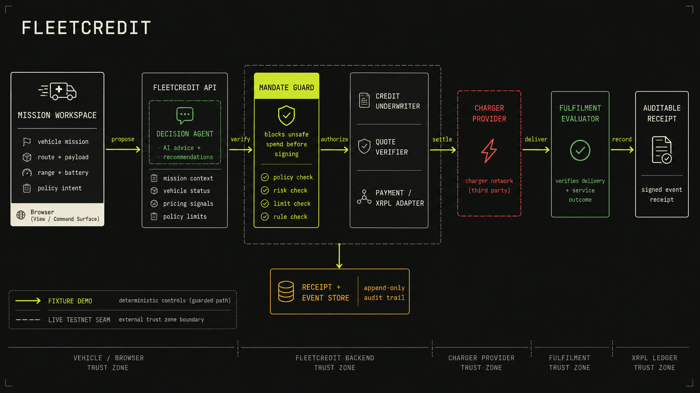

# FleetCredit architecture

FleetCredit gives an autonomous fleet vehicle narrowly scoped economic capacity
when a verified mission requires energy. The browser is a view and command
surface; deterministic server services own policy, payment, fulfilment, and
evidence.

_AI-generated overview in the Tactical Signal Grid style selected in
`GOAL.md`. The diagram is intentionally high-level; this document is the
source of truth for the boundaries and runtime seams._

## Core flow

1. **Mission workspace** captures the dispatch, vehicle telemetry, route risk,
   and operator mandate. It can request actions, but it cannot sign payments or
   manufacture settlement evidence.
2. **Decision Agent** proposes an ordering of charger offers and explains the
   tradeoffs. Its output is schema-validated, advisory, and never the final
   authorization.
3. **Quote Verifier** and **Mandate Guard** compare final terms against the
   approved operator, connector, destination, price, purpose, expiry, reserve,
   and deadline. Unsafe quote changes stop before signing.
4. **Credit Underwriter** can approve one short-lived mission-energy
   authorization within the fleet cap. It binds the merchant and purpose and
   does not call the signer.
5. **Payment / XRPL Adapter** creates the bounded payment intent and settles
   through the fixture adapter by default, with recorded-Testnet and live-
   Testnet seams behind the same typed contract.
6. **Charger Provider** handles quote, payment challenge, reservation,
   connection, and metered energy events. **Fulfilment Evaluator** checks the
   delivered energy and mission outcome before the receipt is ready.
7. **Receipt + Event Store** records the mandate, decision, quote changes,
   payment evidence, fulfilment result, and limitations as an append-only audit
   trail.

## Trust zones

| Zone | Responsibility | Explicit limit |
| --- | --- | --- |
| Vehicle / browser | Render mission state and send user commands | No private keys, arbitrary transaction JSON, or client-authored receipts |
| FleetCredit backend | Own state transitions, policy, underwriting, payment intent, and evidence | Model advice is untrusted; all money-moving actions pass deterministic guards |
| Charger provider | Return offers and fulfil the selected charging authorization | Clean provider-side fulfilment remains outside the public browser bundle |
| Fulfilment | Verify reservation, connection, metered energy, hashes, and mission viability | Settlement can remain recorded when fulfilment fails; no fabricated refund or success |
| XRPL adapter | Settle a bounded payment and reconcile the same transaction | Only the live adapter can report live-Testnet evidence; fixture mode is simulation |

## Runtime modes

- `fixture`: deterministic local demo with `FIXTURE DEMO` labeling and no real
  signature or submission.
- `recorded-testnet`: stable rehearsal using previously validated evidence;
  never presented as a fresh payment.
- `testnet-live`: server-only signer and XRPL Testnet reconciliation when the
  required environment is configured.

The generated image uses `FIXTURE DEMO` and `LIVE TESTNET SEAM` as visual
legend labels so the presentation stays honest when the demo is run locally.
