# ResearchAgent architecture

The browser is a view and command surface. The Express server owns retrieval,
allowlist filtering, ranking, evidence-family lineage, budget arithmetic,
premium access, fixture x402 quotes, and cited synthesis. The twenty mock
articles live in `data/mock-articles.json`; the browser receives public
metadata first and article excerpts only after the exact purchase decision.

```mermaid
flowchart LR
  U[Researcher\nquestion + website allowlist] --> UI[React research desk]
  UI -->|REST + SSE| API[Express ResearchAgent API]

  API --> PLAN[Query planner\nsemantic / lexical terms]
  PLAN --> REG[Mock source registry\n20 JSON articles]
  REG --> FILTER[Allowlist + source-type filter]
  FILTER --> RANK[Ranking + family clustering\nrelevance · novelty · authority]
  RANK --> GAP[Gap analyzer]
  GAP --> GUARD[Budget + preference guard]

  GUARD -->|open| OPEN[Public metadata + preview]
  GUARD -->|premium candidate| QUOTE[x402 quote\nresource · price · payee · drops]
  QUOTE --> LEDGER[XRPL adapter\nfixture by default; Testnet seam]
  LEDGER --> ACCESS[Exact access grant]
  ACCESS --> READ[Server-only article body\nexcerpt + span hash]

  OPEN --> SYNTH[Claim extractor + cited synthesizer]
  READ --> SYNTH
  SYNTH --> ANSWER[Sentence-level citations\nanswer + uncertainty]
  ANSWER --> UI

  API --> STORE[JSON run/event store]
```

## State and trust boundaries

1. `question + sourceAllowlist` is captured in the run config before retrieval.
2. `Query planner` creates bounded terms; it does not choose a wallet or edit
   the budget.
3. `Source registry` loads the synthetic records and strips the `article` body
   before a public response.
4. `Budget guard` is deterministic. It can mark a record BUY, SKIP, DEFER, or
   BLOCKED; browser text and future model output cannot bypass it.
5. `x402/XRPL adapter` models the payment challenge and settlement boundary.
   Fixture settlement is not a real ledger result.
6. `Access grant` is separate from payment and unlocks exactly one resource.
7. `Cited synthesizer` sees only open evidence and purchased excerpts. It emits
   claim text, stance, source ids, evidence spans, and uncertainty—not private
   chain-of-thought.

## Current fixture contract

- Budget: S$2.00 total, with an S$1.00 per-source ceiling.
- Default website allowlist: all eight source profiles shown in the UI.
- Article corpus: 20 synthetic fixture records with prices and XRPL drop
  quotes; 12 preserve the original data-centre demo and 8 add bond-market
  coverage for the final sprint story.
- Server mode: `APP_MODE=fixture`, `XRPL_MODE=fixture`.
- Future live mode: server-only environment variables, never `VITE_` secrets.
