# UX redesign: calm guided research workspace with a separate expressive home/demo

## Status and intent

Canonical local design contract for [issue #58](https://github.com/Collaboration95/theFastandtheFungible/issues/58). Start execution at [README.md](README.md), use [IMPLEMENTATION-PLAN.md](IMPLEMENTATION-PLAN.md), and verify using [TESTING.md](TESTING.md). This package contains plans and baseline evidence, not an implemented redesign.

This design brief proposes a presentation and interaction redesign for the ResearchAgent product. It does not change security or application contracts by itself.

The current product proves a valuable research/payment workflow, but the interface makes that workflow harder to understand than it needs to be. The confirmed direction is a modern, calm working app with crisp neutral sans-serif typography, quiet surfaces, one restrained accent, clear hierarchy, and generous breathing room. The first-run home/demo may be more expressive and explanatory, but the working research desk should remain focused and tool-like.

The primary audience is the same person who starts ChatGPT deep research: someone with a broad research question who wants deeper evidence, access to paid articles when useful, and more precise control over how much money the system may spend. This is not a finance-only analyst product, even though the current fixture story is data-centre research. A useful product-promise draft is “Deep research, with paid sources and spending you control”; this wording is a proposal for review, not a brand decision. The future product supports broad research needs; clickable demo examples must stay inside the supported fixture scope until real source adapters exist.

This ticket proposes superseding the presentation restrictions in #19, #32, and #33 if this redesign is adopted. It does not rewrite or weaken security, payment, protected-content, citation, or server-authority contracts. Existing issues should remain open/closed according to their own status; this ticket must not close or edit them.

## Problem and evidence

The supplied screenshot review and current repository audit show a coherent implementation underneath a confusing visual surface:

- S01 (4:15:39) shows a budget slider/current-XRP treatment that can make a cap look like a charge or wallet balance.
- S02 (4:15:42) combines source-profile selection and budget in a dense setup surface despite an existing selection count; the count alone does not resolve the competing decisions or explain the authorization boundary.
- S03 (4:16:04) shows a plan overview with a giant repeated heading and inline fields that read like raw implementation controls.
- S04 (4:16:40) expands eight raw plan-step editors, creating unnecessary cognitive load for a plan that should be one useful summary with advanced editing available progressively.
- S05 (4:16:44) exposes stop conditions and approval in a dense surface that needs a clearer distinction between planning and exact purchase consent.
- S06 (4:17:04) shows an Anthropic question alongside data-centre evidence in three columns. This is a real scope/truthfulness defect, not a layout problem alone.
- S07 (4:17:09) shows overlapping source actions, noisy tags, and activity competing in the same workspace.
- S08 (4:17:13) repeats the lower-list density and action ambiguity seen in S07.
- S09 (4:17:20) shows the contradictory purchase checkpoint: “No paid source selected” alongside a candidate and a disabled answer action.
- S10 (4:32:44) and S11 (4:32:53) are Uxcel and Jasper inspiration references, not application defects and must not be described as current UI findings.

The repository audit screenshots are a separate evidence set: tracked `screenshots/audit-01-landing.png` through `audit-05-dossier.png` document the verified fixture journey and its current gaps. They should not be conflated with S01–S11.

The particularly important contradiction is the combination of “No paid source selected,” a visible premium candidate, and a disabled answer action. The interface should explain the state and next step in plain language instead of forcing the user to infer backend conditions. An arbitrary Anthropic prompt screenshot also produces data-centre fixture evidence. That is a data/scope truthfulness problem: the product needs a truthful unsupported-scope response, not a design-only treatment that pretends arbitrary web research happened.

The current evidence universe is a set of named fixture profiles that define authorization boundaries, not endorsements that their claims are true. A “Trusted sources” helper must say “allowed to read” or equivalent, never imply that the sources are guaranteed accurate. Future real-domain entry belongs behind adapter validation and is outside this visual redesign. Fixture/demo labels, protected-content boundaries, citation checks, exact quote approval, and server guards must remain visible and honest.

The repository audit dated 20 September 2026 records earlier passing automated verification for the fixture journey, including plan approval, exact quote review, purchase confirmation, protected unlock, and cited synthesis. Those prior results do not validate the proposed redesign.

## Desired outcome

A user should be able to understand and resume the product through one guided, durable sequence:

**Question → Sources → Budget → Review → Research → Answer**

The sequence is the preferred baseline for guidance, not an immovable backend screen order or six mandatory full-page screens. Each step owns one decision, persists draft state where appropriate, and offers Back, Save draft, and Skip when the action is optional. The user should never encounter chained mandatory dialogs or nested dialogs. Editing a setup summary may use a short focused modal; long source selection remains a full step or panel. Exact purchase approval uses a separate focused confirmation modal that cannot be silently bypassed. The review step contains one readable plan summary by default and exposes advanced editing progressively.

The primary workspace is centered on the answer and research progress. Sources and Activity are secondary tabs. A compact brief/budget summary stays available without becoming a third column. There are no three simultaneous desktop columns. The interface must make the next meaningful action obvious while keeping the evidence trail inspectable.

Paid articles are optional. The audit found a concrete client defect: `ActivityRail` disables synthesis until a BUY exists, although server synthesis and the research plan support open-only completion. Remove this client purchase prerequisite when accessible evidence is available, retaining plan approval, phase/readiness, and citation guards. An empty or unsupported evidence set must produce a truthful limitation, never a fabricated answer. This is an existing client/server inconsistency, not a new pay-to-answer requirement.

## Durable UX principles

1. **One primary decision per surface.** A screen or modal should answer “what do I need to decide now?” Secondary facts remain available through disclosure, tabs, or an evidence drawer.
2. **Human-readable state before technical state.** Say “This article exceeds your per-article limit” with the exact XRP amount and a labelled SGD estimate before exposing quote hashes, version IDs, or adapter details.
3. **Progress is resumable.** Drafts, Back, pause/resume, and recovery preserve the user’s question, selected source profiles, budget, decisions, and last safe state. Leaving a step must not destroy work.
4. **Consent is explicit and bounded.** Purchase approval names the exact source, exact XRP amount, SGD approximation, quote expiry, network/mode, and final action. No purchase is implied by reaching a review step.
5. **The server remains authoritative.** Visual simplification cannot bypass plan approval, quote binding, budget ceilings, protected evidence, settlement checks, citation validation, or fixture/live boundaries.
6. **Calm density, clear hierarchy.** Reduce repetition before reducing useful information. Use one accent for the active action and semantic state colors only with text labels.
7. **Truthful scope.** Unsupported arbitrary prompts, unavailable history/library capabilities, fixture settlement, synthetic corpus records, and fallback synthesis must be stated in the product state where they matter.
8. **Recovery is part of the design.** Every blocked, failed, paused, expired, or unavailable state must tell the user what happened, what is preserved, and what action is possible next.

## Screen and interaction specifications

### 1. First-run home/demo

The first-run landing page has a restrained expressive hero: one clear statement of the product-promise draft, one question composer, broad examples such as comparing policy options or investigating a company, and a compact “How it works” explanation for Question, Evidence, and Answer. Use editorial illustration or richer accent treatment only in this home/demo context. Do not repeat the user’s question as a giant heading after submission. A returning user with a saved draft or recent run goes directly to the workspace with a small “New research” action.

The composer accepts a question and keeps the selected example visible as a normal editable value. It must state that the current demo uses approved synthetic data-centre source profiles. If the prompt is outside that supported fixture scope, show a calm unsupported-scope result with the supported scope and a path back to editing; do not render data-centre evidence as though it answered the arbitrary request.

### 2. Question and Sources

After Question, show a compact step header and a single working card. The question is editable in place. Sources are represented as explicitly selectable named profiles grouped by evidence family, with a visible selected-source count and an Edit link. Do not present raw domains as if arbitrary browsing is available. A “Trusted sources” helper must explain that selected profiles are sources the system is allowed to read, not guarantees that their claims are accurate. A separate disclosure can explain fixture approval and future adapter validation.

The primary action is “Continue to budget.” Back returns to the home/draft state. Save draft is available but quiet. If the user has not selected a source profile, explain the minimum required selection inline and keep the action disabled with an accessible reason.

### 3. Budget

Budget is a compact mandate editor, not a dashboard. Label the control **Maximum research spend** and distinguish it from wallet balance and each source’s actual quoted price. Show the XRP cap, the fixture conversion “1 XRP ≈ S$10.00,” and a direct note that this is an approximation used by the demo, not live FX. Persist the cap, spent, and remaining values throughout the run. Show per-source ceiling if configured, with a plain-language explanation.

The budget editor must state: “Maximum research spend: X XRP.” Setting this cap is not an immediate charge and is not exact purchase consent. If a wallet balance is available, show it as a separate value; never represent the cap as the balance. If a future live wallet is involved, show the network and payer authority from the validated contract. Back and Save draft preserve values. Continue opens Review; exact spending consent occurs only in the purchase modal.

### 4. Review

Review is one readable summary of the plan: question, selected source families, maximum research spend, per-source ceiling, intended questions/approach, and what the system may do. Do not claim an evidence gap before research has run. Use definition-list rows and short prose. Advanced editing is progressive disclosure: an “Edit advanced settings” control reveals stop conditions, horizon, technical limits, and other implementation-level fields in a secondary region. Do not expand eight editable plan steps by default. Do not prefill an arbitrary horizon such as 2028 for a non-demo prompt.

The primary action is “Approve plan & start research.” This approves the research plan, not a purchase. “Back” returns to Budget. A clear “Save draft and exit” preserves the state. If the current backend requires plan approval before retrieval, reflect that exact gate in the copy and status. Do not add a redundant confirmation dialog. A server draft may be created to generate the plan, but retrieval, protected access, and purchase must remain gated by their respective approvals.

### 5. Research workspace

The workspace uses a centered answer/progress panel as the primary region. Its header contains the question in one compact line, current phase, pause/resume, and a compact brief/budget summary. The summary opens a short modal for editing when the run state allows it; it does not create a side column.

Below the progress panel, use two secondary tabs: **Sources** and **Activity**. Sources contains the source list, previews, evidence-family grouping, price, and available actions. Activity contains meaningful state transitions, purchase receipts, skips, blocks, errors, and resumable recovery. The document owns vertical scroll; no full-height nested panel should trap the user.

Source rows must have a stable order: source title and access state, one-sentence relevance, evidence family, protected/open label, price, and one action area. Use “Review purchase” before the quote dialog, “Skip” for a user decision, and “Blocked” for a policy state. The row should never show overlapping price/action controls or duplicate raw metadata. Technical details are disclosed under “View quote details” or the evidence drawer.

Maintain a persistent budget strip: **Cap X XRP · Spent Y XRP · Remaining Z XRP** with the SGD approximation beside the values, and keep any wallet balance and actual source price separately labeled. When a source exceeds remaining budget or the per-source ceiling, show a system-owned “Blocked” state with the exact reason and offer “Continue without it.” When no paid source is selected, do not show a generic disabled Answer button beside a premium candidate; show “Answer from available evidence” and a separate optional “Review paid source” action. A recommendation awaiting consent is not the same state as no recommendation.

### 6. Exact purchase approval

Selecting “Review purchase” opens one focused modal. It shows source name, why it may change the answer, exact quoted amount in XRP, SGD approximation, cap/spent/remaining after purchase, quote expiry, network/mode, protected-content terms, and the final approval control: “Approve purchase of X XRP.” A short note must label fixture settlement as simulation and clarify that it does not pay a real publisher. The user can cancel without changing state.

The modal must bind approval to the exact quote and preserve current server guards. If the quote expires, return the user to the source row with a re-quote action. After success, return focus to the source row, announce the unlocked state, and show the receipt in Activity. Manual exact quote approval remains required even if the system recommends the source.

### 7. Answer

Answer is the primary destination after research and permitted synthesis. Start with a concise answer, then uncertainty and limitations, then claim-level citations. Keep source metadata and raw technical identifiers behind citation inspection. State whether evidence is open, premium/unlocked, fixture, fallback, or unavailable. Expose “Answer from available evidence” when the approved run has usable evidence. Do not require a BUY merely to generate the final answer.

History and Library navigation should appear only when their UI and contracts are actually available. Until then, remove dead navigation or label those capabilities as unavailable; do not send users to empty shells.

## Placement and component rubric

Every feature added during implementation must document: when the user needs it; whether it is default, secondary, or advanced; its component and owning state; loading, error, blocked, and recovery states; responsive behavior; and keyboard/screen-reader behavior. The default surface contains only the next decision and the evidence needed to make it. Secondary tabs and drawers hold inspection. Advanced settings live behind progressive disclosure. Recovery actions remain near the state that needs recovery.

Create or consolidate shared primitives for StepHeader, QuestionComposer, SourceProfileList, BudgetSummary, ProgressPanel, SourceRow, ActivityFeed, Disclosure, EvidenceDrawer, and ApprovalModal. Use semantic tokens rather than page-specific overrides. Recommended tokens include background, surface, text, muted text, border, accent, success, warning, danger, focus ring, radius, spacing, and type scale. Use a neutral sans-serif for interface and answer text; reserve any expressive/editorial face for first-run home/demo content. Keep animation minimal and honor reduced motion.

## Responsive and accessibility requirements

Design and verify at 360, 390, 768, 1024, and 1440 CSS pixels, plus 200% text zoom and 320 CSS pixel reflow. At narrow widths, stack the summary, progress, tabs, and source rows; preserve all source actions and statuses. At tablet/desktop widths, widen the centered workspace without adding a third simultaneous column. The body must have no horizontal overflow.

Meet WCAG 2.2 AA for contrast, focus visibility, names/labels, status announcements, target sizing, and error identification. Dialogs must trap focus, close on Escape when safe, restore focus to the invoking control, and expose a descriptive title and initial context. Keyboard users must complete the full path, including source selection, review approval, disclosure, exact purchase approval, pause/resume, and answer citation inspection. Live regions announce material state changes without reading every activity event.

## Acceptance criteria

1. The implemented flow presents Question, Sources, Budget, Review, Research, and Answer as a coherent resumable sequence with Back, Save draft, and optional Skip where applicable.
2. First-run home/demo and returning workspace are distinct states; returning users with a saved draft can resume without repeating the landing explanation.
3. No mandatory interaction requires chained or nested dialogs. Source/budget editing uses a short modal or focused panel; exact purchase approval uses one explicit modal.
4. Review shows a human-readable plan by default and keeps advanced fields behind progressive disclosure.
5. The active workspace has one primary answer/progress center with Sources and Activity secondary tabs; no three-column default layout is present.
6. Every source row has non-overlapping title, access state, relevance, price, and action controls at all required widths.
7. Cap, spent, and remaining authority persist visibly during a run. XRP authority, SGD approximation, fixture rate, and fixture/demo labels are explicit.
8. A purchase approval names the exact source and exact quote, preserves server quote/authorization guards, and clearly separates recommendation from user approval.
9. Protected content remains inaccessible before verified purchase; citations remain bound to accessible evidence spans; fixture settlement cannot be described as payment to a real publisher.
10. Unsupported arbitrary prompts produce a truthful unsupported-scope state and do not display unrelated fixture evidence as an answer.
11. History and Library are either usable with their intended contracts or absent/clearly unavailable; no dead navigation remains.
12. At 360/390/768/1024/1440 widths, 200% text zoom, and 320 CSS pixel reflow, there is no body horizontal overflow, no clipped critical action, and no hidden purchase consent.
13. Keyboard and assistive technology checks meet WCAG 2.2 AA expectations for the full path, including modal focus management and meaningful live-region updates.
14. An approved run with usable open evidence can produce a cited answer without a purchase; empty or unsupported evidence cannot masquerade as a completed answer.
15. A five-person qualitative pilot is proposed with targets, not claimed evidence: at least 4/5 participants complete the basic flow without facilitator intervention; 5/5 correctly explain cap, spent, remaining, and the exact approval amount before confirming; and no participant encounters a critical barrier to backing out, resuming, or understanding whether evidence is open, premium, fixture, or unavailable.

## Verification plan

Run component and integration checks for draft persistence, step transitions, unsupported scope, budget math, quote expiry, approval cancellation, server-authoritative refresh, protected-content access, citation rendering, and recovery after pause/error. Run the existing project verification commands only after implementation and report their actual results; baseline audit checks are recorded below; redesigned behavior remains unimplemented and unverified. Perform manual visual review at all required widths, text zoom, 320 reflow, reduced motion, keyboard-only navigation, screen-reader labels, and modal focus restoration. Compare against S01–S09 defects and S10–S11 inspiration references and the five tracked repository screenshots where useful. Use the bundled original screenshot gallery and tracked baseline images for review; no local Desktop paths or conversation access are needed.

## Design gates and deliverables

Before production UI implementation, produce an editable screen/state map and a clickable low-fidelity prototype covering the complete setup, unpaid completion, paid-source approval, error recovery, and answer inspection paths. Then produce representative high-fidelity desktop and mobile screens for Question, Review, Research, purchase approval, and Answer. A token sheet and component/state inventory must accompany them; polished happy-path screenshots alone are insufficient.

Review the prototype against the acceptance criteria before implementing slices. Reconcile `docs/contracts/DESIGN.md` and `docs/contracts/UX-CONTRACT.md`: replace old theme restrictions and stale purchase-required wording with the adopted direction, while preserving server-owned permission and evidence contracts. This issue is the design brief, not a claim that wireframes or redesigned screens already exist.

## Staged rollout

First address unsupported-scope output and the unnecessary purchase gate as bounded correctness fixes, then implement slices that can be reviewed independently: (1) tokens, typography, shell, and first-run/returning states; (2) Question/Sources/Budget with saved drafts; (3) Review and progressive advanced editing; (4) centered workspace with Sources/Activity tabs and persistent budget strip; (5) exact approval modal and recovery states; (6) Answer, citations, unsupported scope, and truthful fixture labels; (7) responsive/accessibility hardening and pilot evaluation. Each slice should retain the existing backend guards and be demonstrable without requiring a broad visual rewrite in one merge.

## Dependencies and related work

Coordinate with #35 (plan), #36 (manual purchase), #37 (dossier), #38 (history), #39 (library), #42 (multi-purchase), #43 (uncertainty), #50 (wallet), and #55 (validation). #38 and #39 should not gain dead navigation merely to match a visual mockup. The audit’s earlier verification and existing issue contracts are inputs to this redesign, not evidence that this ticket’s acceptance criteria have passed.

Related presentation work includes #19, #32, and #33. On adoption, this ticket supersedes their presentation restrictions where they conflict with the calm guided flow and separate expressive home/demo. It does not supersede their security or domain contracts, and it does not ask maintainers to close or rewrite those issues.

## Confirmed decisions and remaining design choices

**Confirmed with the user:** a general deep-research audience; useful paid-article access with precise spending controls; quiet neutral sans-serif workspace with one accent; guided Question → Sources → Budget → Review as the preferred baseline; freedom to improve the current interaction order. The separate expressive home/demo is allowed, not a mandate to animate the product workspace.

**Decide in the prototype:** exact accent and typeface, example prompt wording, visual treatment of draft/resume, and whether short post-setup edits use a dialog or panel. These details do not block adopting the information architecture. Source adapters and wallet capabilities remain truthful to runtime support.

All supplied S01–S11 originals are bundled in this repository and embedded below. [EVIDENCE.md](EVIDENCE.md) separates current-product defects from the two inspiration references; [assets/manifest.json](assets/manifest.json) records original names, dimensions, and checksums. Older repository audit screenshots remain a separate evidence set.

## Audit evidence and implementation anchors

Audited checkout: `fc177016430811158d913be12f130f68a49bcc10` (20 September 2026). Code references below are current implementation anchors, not proposed component locations.

| Finding | Evidence and required response |
| --- | --- |
| P1: question/evidence mismatch | `src/App.tsx:323` accepts free questions; `server/index.ts:181` and `:189` retain data-centre gap/claims. Local walkthrough reproduced the mismatch with an office-rent question. Add coverage/scope handling before presenting research as relevant. Coordinate #18 and #52 rather than pretending new web retrieval exists. |
| P1: unnecessary purchase requirement | `src/App.tsx:192`–`:200` gates on BUY; `server/index.ts:270` synthesis and `src/research-plan.ts:237` allow open completion. Remove the client gate and verify unpaid cited output against accessible spans. |
| P1: plan form layout | `src/App.tsx:103`–`:116` supplies plan-specific class hooks without matching styling in `src/styles.css`. Replace raw inline editors with shared labelled form components and progressive editing. |
| P1: source action collision | `src/styles.css:146` and `:497` reserve narrow action columns; `src/App.tsx:128`–`:142` uses long action labels. Size/wrap action regions and verify long names/prices at every breakpoint. |
| P2: payment-mode ambiguity | Generic runtime header wording is weaker than quote details. Show Synthetic corpus and Fixture settlement / XRPL Testnet as separate facts; corpus mode and payment mode must not be conflated. |

The delegated audit covered local entry, plan approval, retrieval, evidence, and the unpaid checkpoint. It did not exercise payment or final synthesis live. Open-only synthesis support was inspected in code; end-to-end unpaid completion still needs an implementation regression test. The audit reported typecheck and 19 unit/persistence tests passing; none demonstrates the proposed UX is complete.

Baseline repository evidence: [plan review](https://github.com/Collaboration95/theFastandtheFungible/blob/fc177016430811158d913be12f130f68a49bcc10/screenshots/audit-02-plan-review.png), [workspace](https://github.com/Collaboration95/theFastandtheFungible/blob/fc177016430811158d913be12f130f68a49bcc10/screenshots/audit-03-evidence-workspace.png), [purchase confirmation](https://github.com/Collaboration95/theFastandtheFungible/blob/fc177016430811158d913be12f130f68a49bcc10/screenshots/audit-04-purchase-confirmation.png).

## Required state and recovery matrix

| State | Primary presentation | Next action / invariant |
| --- | --- | --- |
| Setup draft / invalid field | Current step, saved values, inline explanation | Back and resume preserve values; no spend on Continue. |
| Unsupported question / no sources | Explain available coverage without unrelated answer text | Edit question or source scope; no deceptive successful research state. |
| Plan awaiting approval | Readable plan plus compact limits | Approve plan & start; no discovery before approval. |
| Research running / paused | Named phase and concise progress, no invented percentage | Pause/resume/stop preserve server state; distinguish stop from delete. |
| Evidence sufficient, no purchase | Open-evidence answer available with limitations | Generate answer without buying; premium remains optional. |
| Paid source proposed | Why it helps, exact price, remaining budget | Review purchase or continue without; proposal is not approval. |
| Over cap / over ceiling | Blocked with amount and precise policy | Continue without; never offer a purchase CTA that bypasses policy. |
| Approval cancelled / quote expired | No new charge; refreshed status | Return focus or request fresh quote and explicit reapproval. |
| Purchase pending / connection lost | Processing or outcome unknown | Reconcile server state before retry; never issue a blind duplicate payment. |
| Settled but access pending/failed | Payment and content-access status shown separately | Recover fulfilment/receipt; do not charge again or claim unlocked. |
| Content unlocked | Accessible evidence and receipt | Inspect citation; show what it adds without claiming paid means correct. |
| Synthesis draft / validation failure | Draft until validated; clear retry/fallback limitation | Never present invalid citations as final; preserve available evidence. |
| Reload / stale run / new research | Restore last server state or explicitly explain unavailable draft | New research does not delete prior receipts or mutate a completed run. |

## Extension rules and concrete visual targets

- For every new feature, document its user task, when needed, primary/secondary/advanced placement, reused component, full state set, and mobile/keyboard behavior. Review this with the feature PR. No feature earns a dashboard card solely because an API exists.
- Use a 4/8px spacing scale, a small shared radius scale, and consistent button/input heights. Prototype starting points: 16px reading text, 24–32px workspace heading, 44px primary touch controls, 640–760px setup column, and 65–80-character answer lines. These are design targets to validate, not claims that one numeric scale guarantees usability.
- One primary filled action per task region. Avoid nested bordered cards, uppercase monospace metadata paragraphs, oversized repeating question titles, score-as-truth presentation, ornamental badges, and competing sidebars.
- Use text equivalents for semantic colors. Prices may use tabular numerals; technical quote IDs belong in details. Interface and answer text stay sans-serif; marketing may use a different display treatment.
- Existing server-owned budget/source constraints must remain read-only after approval unless a versioned, reapproved mandate-edit contract is implemented. “Edit” cannot silently widen access or spending authority.
- Keep per-article ceiling editable only where the server contract supports it. A cap is not a wallet balance. If $-first budget entry is later introduced, define authoritative conversion, rounding, and quote currency before exposing it; never treat the fixture exchange rate as live money pricing.

## Usability evaluation and definition of done

Recruit five representative deep-research users for a small qualitative pilot; this is not statistical validation. Compare task success and confusion with the current interface. Test: start a supported question with a spending cap; change sources and return without losing work; explain cap versus charge; finish with open evidence; review and cancel a paid article; understand an over-limit block; approve a simulated/test purchase; find its citation and receipt; recover a stale quote/network error; identify an unsupported question. Include keyboard-only and narrow-screen checks.

Proposed targets: 4/5 identify the next action and configure question/source scope/cap within the first minute without help; 4/5 finish the basic setup unaided; 5/5 can state the exact approval amount, remaining budget, and whether settlement is simulated/Testnet; no critical purchase, scope, keyboard, or data-loss confusion. Record observations and revise failures rather than treating aesthetic preference as evidence. Coordinate with #55; earlier two-to-three-participant validation remains useful but is not evidence these new targets passed.

Completion requires the design artifacts, reconciled contracts, implemented slices, reproducible responsive screenshots, unpaid and paid-path regression checks, keyboard/focus review, and documented pilot findings with all critical defects fixed or explicitly tracked as release blockers. Use `npm run verify`, `npm run test:e2e`, and `npm run test:a11y` after implementation; automated accessibility checks complement manual task testing.

## Method references

The proposed placement rules apply [NN/g progressive disclosure](https://www.nngroup.com/articles/progressive-disclosure/) to defer advanced settings while preserving decision-critical limits. Dialog behavior follows the [W3C modal dialog pattern](https://www.w3.org/WAI/ARIA/apg/patterns/dialog-modal/), including focus containment, Escape and focus restoration. Accessibility verification targets [WCAG 2.2 AA](https://www.w3.org/TR/WCAG22/), including contrast, keyboard operation, reflow and status messaging. These guide the design; the flow and numerical usability targets above are product proposals to test.

## Original screenshot gallery

S01–S09 are current product evidence. S10–S11 are references only. See the [evidence guide](EVIDENCE.md) for interpretation.

## Current product defects

### S01 — Screenshot 2026-09-20 at 4.15.39 PM.png

Budget slider and current-XRP label: distinguish spending cap, wallet balance, and estimated currency.

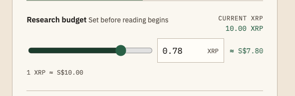

### S02 — Screenshot 2026-09-20 at 4.15.42 PM.png

Source selection and budget share one crowded step; selection count exists but decision hierarchy is weak.

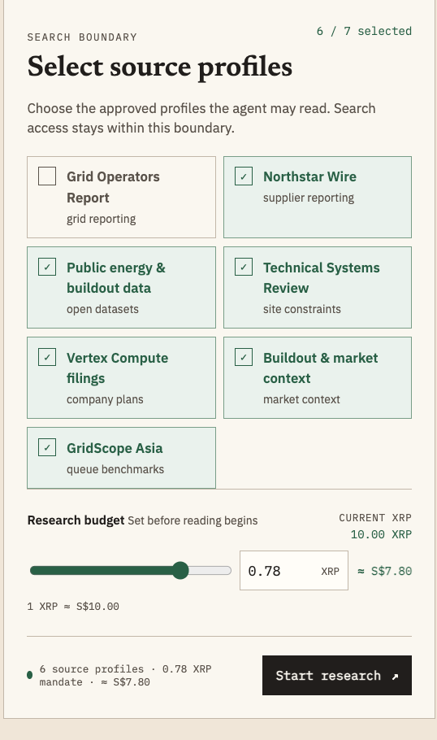

### S03 — Screenshot 2026-09-20 at 4.16.04 PM.png

Oversized question, dense plan overview, and unstyled inline form controls.

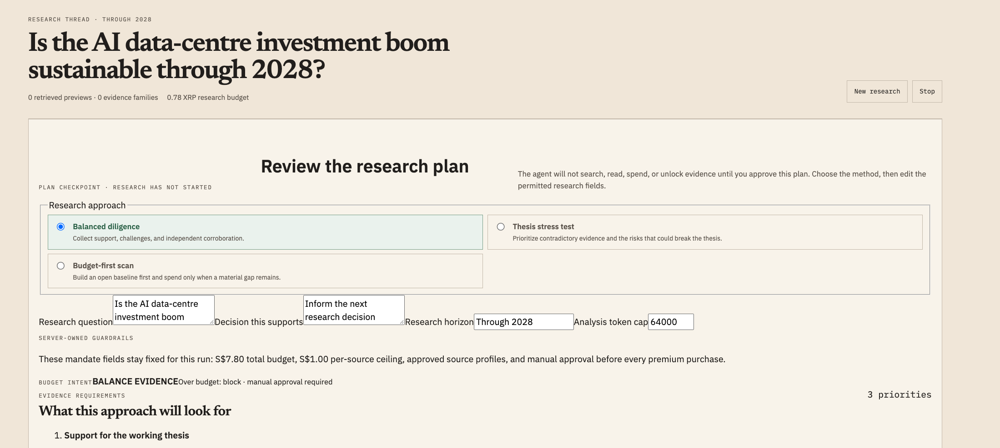

### S04 — Screenshot 2026-09-20 at 4.16.40 PM.png

Eight expanded plan editors expose implementation detail before users need it.

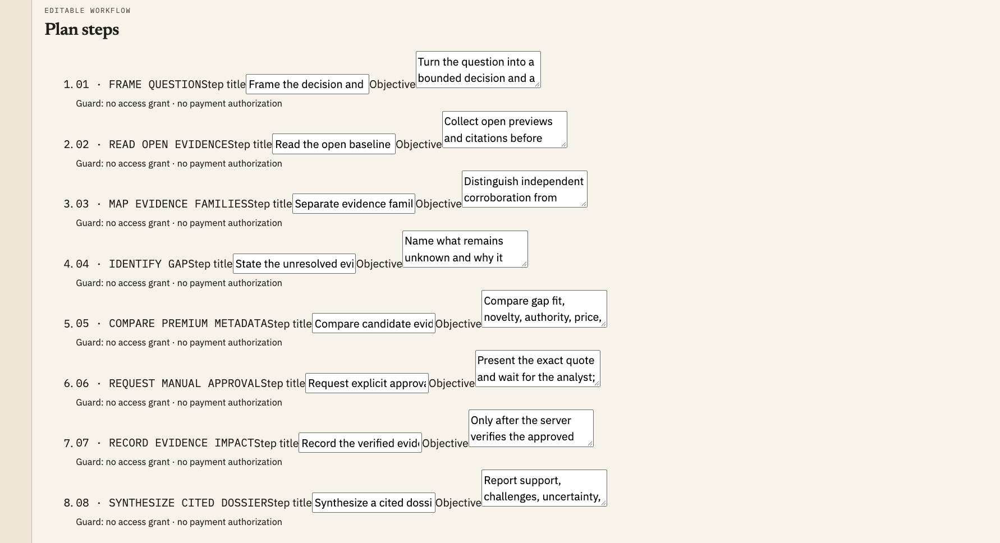

### S05 — Screenshot 2026-09-20 at 4.16.44 PM.png

Raw stop-condition controls and plan approval need grouping and progressive disclosure.

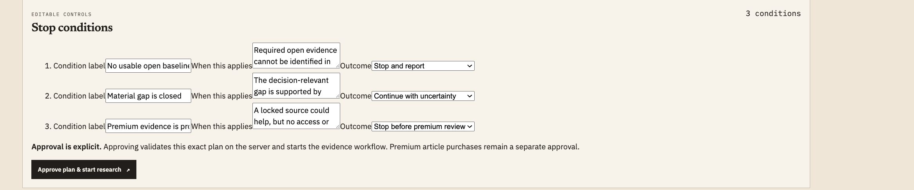

### S06 — Screenshot 2026-09-20 at 4.17.04 PM.png

Anthropic question paired with unrelated data-centre evidence; three competing columns.

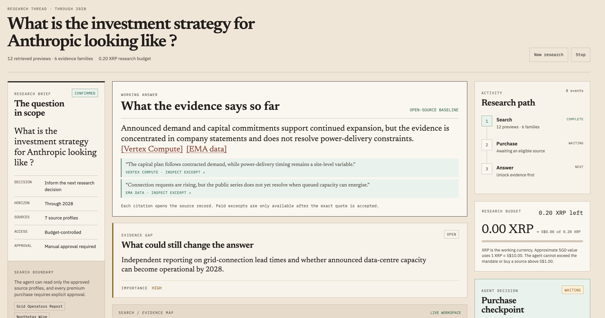

### S07 — Screenshot 2026-09-20 at 4.17.09 PM.png

Purchase actions overlap source metrics; metadata and activity compete with research.

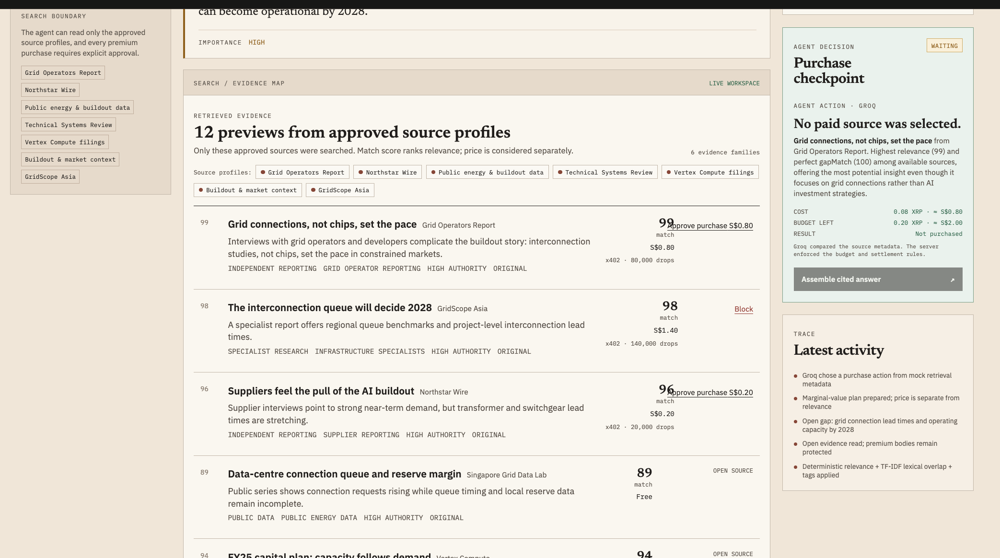

### S08 — Screenshot 2026-09-20 at 4.17.13 PM.png

Lower source list continues the density and action-overlap problem.

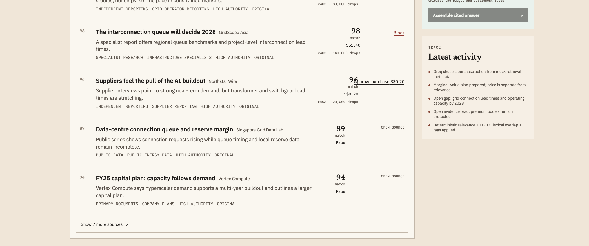

### S09 — Screenshot 2026-09-20 at 4.17.20 PM.png

Contradictory purchase status and disabled final-answer action.

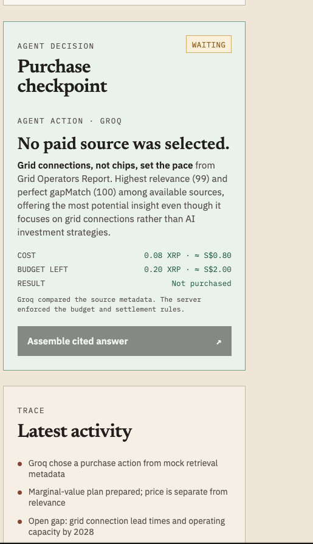

## Reference interfaces

### S10 — Screenshot 2026-09-20 at 4.32.44 PM.png

Reference only: calm shell, spacing, aligned hierarchy. Do not copy irrelevant onboarding or trial banners.

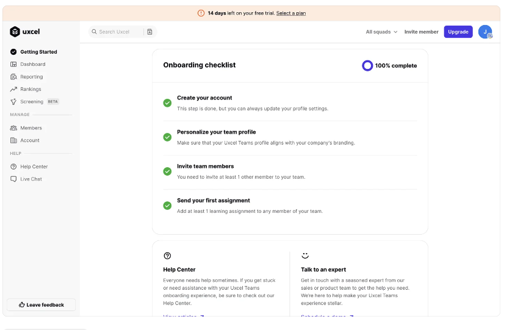

### S11 — Screenshot 2026-09-20 at 4.32.53 PM.png

Reference only: prompt-centered entry and secondary navigation. Do not copy upsells, floating checklist clutter, or branding.

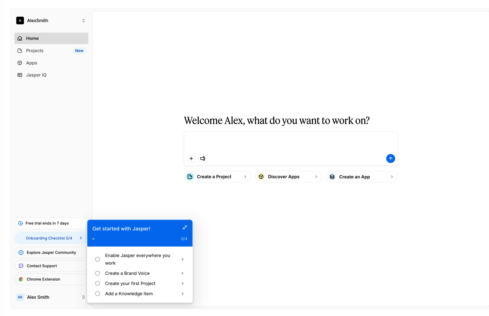
